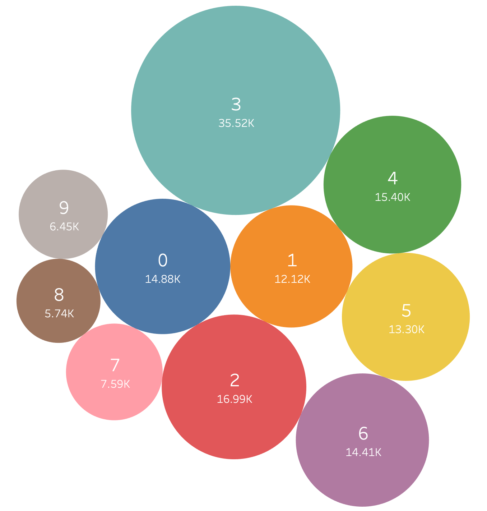
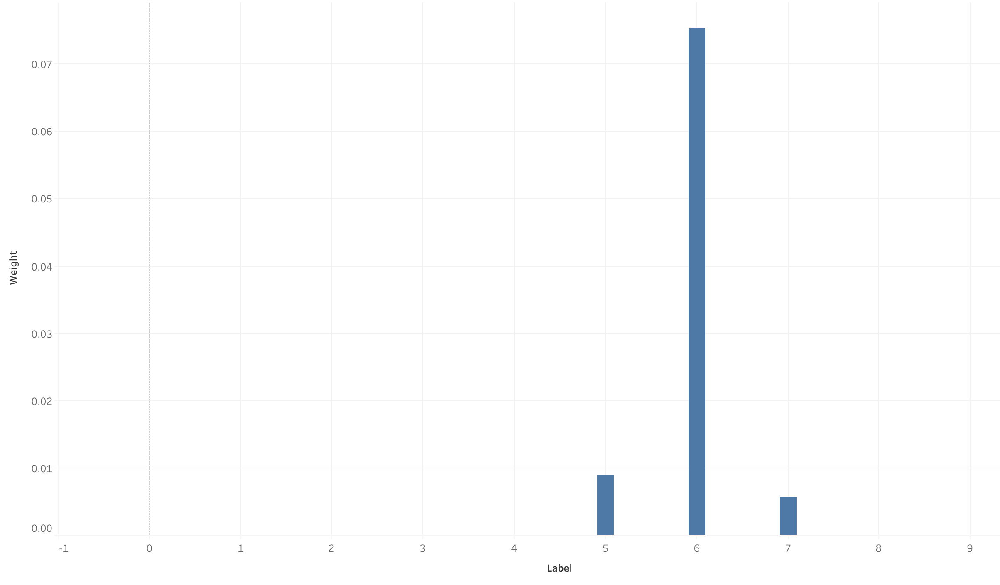
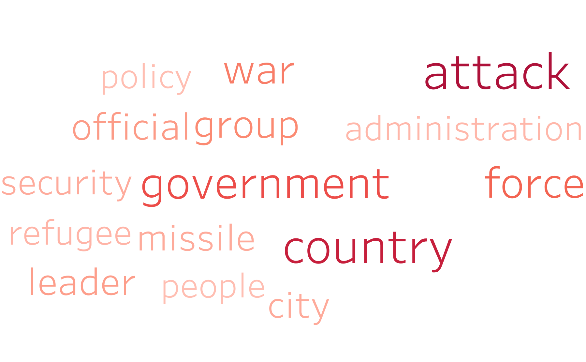
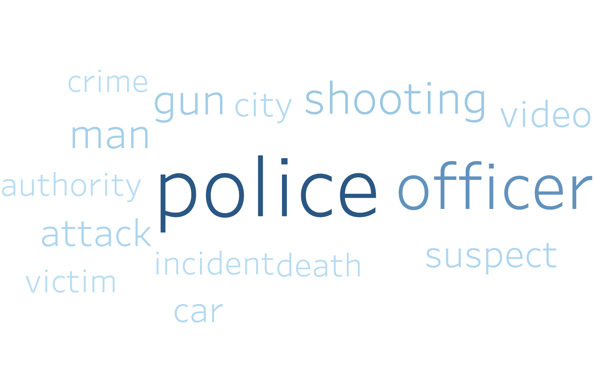
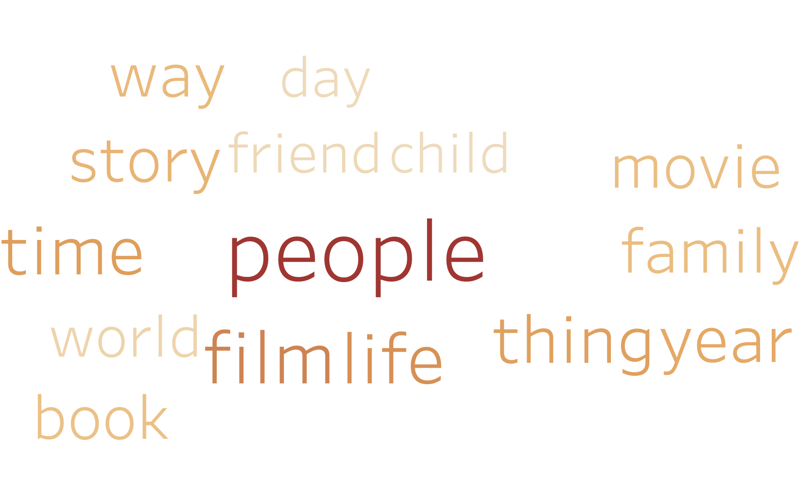
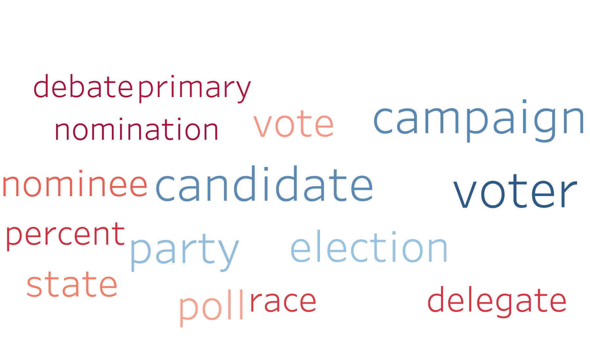
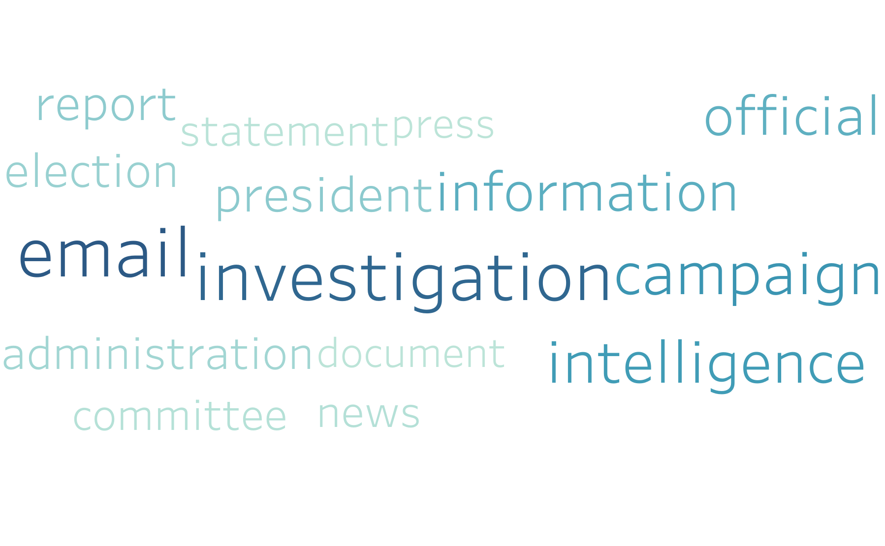
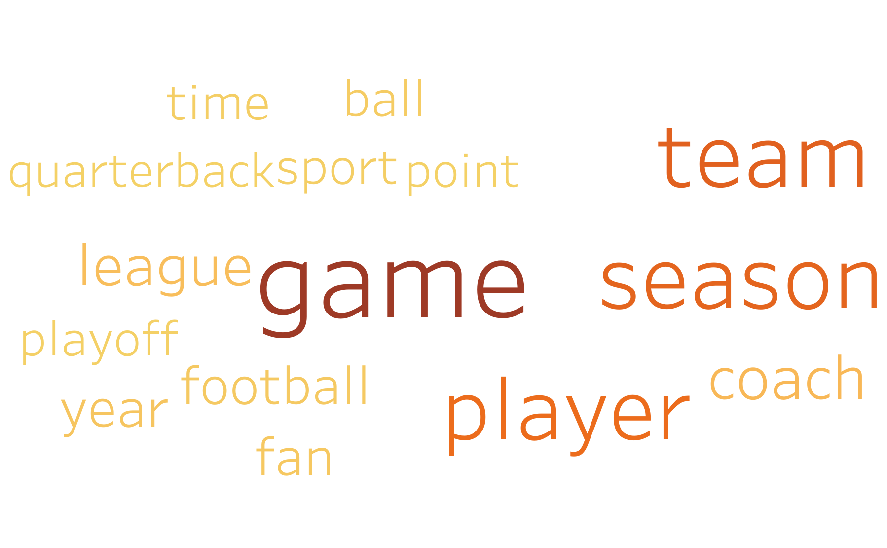
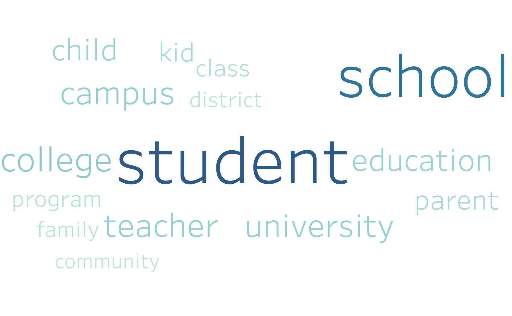
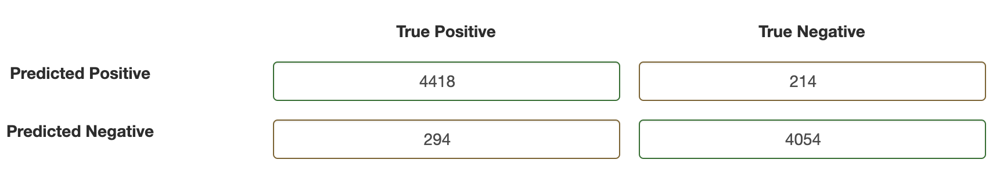

## Purpose
The purpose of our project is to identify whether certain categories of articles were more reliable or more fake through the analysis of different features of an article. Fake news refers to the deliberate distribution of misinformation—news whose main purpose is to distort the truth for the intention of persuasion seeking to drive action. When clustering the data using feature extraction and TD-IDF vectorization, we can separate out the different types of articles into topic models based on the dataset articles’ content. Our goal is to assign each article to one of these topics so that when we run our supervised learning classification it can help identify which topics of articles have the highest tendencies of misinformation. This way online publishers can better partition resources to combat misinformation where it is most needed.

## Unsupervised Portion
For the unsupervised portion of this project our group decided to employ a clustering algorithm in order to get an idea of what topics are present in our datasets. Our datasets are a collection of 143,000+ news articles from various publications with fields for information such as title, publication, author, year, and content. In order to begin creating clusters of the topics present in these articles, we had to first perform data cleaning to eliminate any “noise words”, which in this case were any words that were not informative to the topic of our articles (i.e. non-nouns, pronouns, adjectives, etc.). We therefore ran a remove_nonnouns method which parsed through our dataset articles and removed any non noun words, because topics are almost always nouns and the inclusion of other words would convolute our clustering algorithm.

Next, we used pure feature extraction from the article text content in order to convert our text into numerical values and separate and cluster based on similarity. For this text clustering we used TF-IDF (Term Frequency-Inverse Document Frequency) vectorization, which is a method for comparing these numerical values to determine how important a word is to a collection of texts—in this case our news articles. In other words, this gave us a ratio of the number of current words to the total number of words in our dataset, and we used the highest ratios in order to form our topic word clusters. We performed this TF-IDF Vectorization only on the article content so as to avoid unnecessary clustering based on irrelevant fields like publication name, author, and date. We chose to set the maximum number of features at 5,000 after taking into consideration the high volume of articles and content being parsed. We also chose to ignore terms that appear in greater than 95% of articles and terms that appear in less than 2 articles to ensure that our features are of relatively significant value.

After feature extraction it was time to use a NMF (non-negative matrix approximation) model for topic modeling. This works by decomposing our TF-IDF vectors in order to discover underlying relationships between texts. The result will be clusters of word features belonging to the same topic. We chose to fit our data into ten clusters after concluding that this was the optimal number to ensure proper uniqueness of our cluster topics. The result is ten clusters of 5,000 words separated into groups according to their topic.

### Understanding the Unsupervised Dataset
We separated our data into 10 separate clusters based on the distribution of words in each article. Afterwards, we looked at the most common words for each cluster, and saw that each cluster generally shared a common theme. For example, one cluster had “voter campaign candidate party election poll vote state nominee race” as its 10 most common words—clearly indicating that the articles in the clusters were highly related to political events. Another topic had “game team season player coach league year fan football ball” as its most frequent words, indicating that these articles were generally related to sports. This made sense for our classification, as we would expect articles to cluster around certain types of subjects, and for the words in articles of each subject to be generally more similar to each other than to articles of other subjects, resulting in this subject-based clustering.  

### Group Distribution  

The following image shows the sizes of each cluster of articles. We arbitrarily assigned the following names to the groups based on the general subject matter of the most common words in order to more easily distinguish the groups. Note that these names are in no way objective, and were assigned solely for ease in differentiating the groups.

<ol start="0">
  <li>International Affairs</li>
  <li>Law Enforcement</li>
  <li>Economics</li>
  <li>Entertainment</li>
  <li>Political Events</li>
  <li>Political Investigations</li>
  <li>Healthcare</li>
  <li>Sports</li>
  <li>Education</li>
  <li>Domestic Violence</li>
</ol>

The distribution for our data was fairly similar between the different group labels. The smallest label had 5.74k data points, while the second largest had 16.99k. However, the largest group (with "people, film, life, time, thing" as its most frequent words) had 35.52k, which was quite a bit larger than any other group. This is largely dependent on what data set of articles was used, but it makes sense that the large number of articles with such broadly applicable words would form a single large cluster, while articles with words related to topics like sports or economics that share little overlap would instead form smaller individual clusters.

### Label Weights of Example Article

One example of what happens after clustering is shown for the following article— _House Republicans Fret About Winning Their Health Care Suit_. The following chart shows the likelihoods that the article belongs to each label/category.

Based on the words used in this article, including “health”, “law”, “court”, and “insurance”, we would expect this to be under label 6 (Healthcare). However, it also shares some overlap with the words "president" and "report" commonly found in label 5 (Political Investigations), as well as the word "team" commonly found in label 7 (sports), adding to its likelihood of belonging to those groups. As such, our model gives it around an 76% likelihood of being under label 6, as well as a ~9% likelihood of being under label 5 and a ~6% likelihood for label 7.

It is worth noting that our distribution will have outlier articles. The outliers are either articles that don’t fit very well into any of the topics, or articles that are a combination of the topics. For example, a scientific article about space would be unlikely to fit strongly into any of the topics, or share a lot of words in common with them. On the other hand, an article about the presidential race and its impact on healthcare would likely share many words between labels 4 and 6.

### Visualizations for Each Label

Below, we have created word clouds showing the most frequent 15 words for each of the 10 groups. The words' sizes are directly proportional to their TF-IDF value used to cluster these articles. It is quite easy to see the general subject matter of each of the clusters based on these visualizations. This word cloud pictures were also how we decided on the category names.

**Group 0: "International Affairs"**

**Group 1: "Law Enforcement"**

**Group 2: "Economics"**

**Group 3: "Entertainment"**

**Group 4: "Political Events"**

**Group 5: "Political Investigations"**

**Group 6: "Healthcare"**

**Group 7: "Sports"**

**Group 8: "Education"**

**Group 9: "Domestic Violence"**

All in all, we are satisfied with the results of the unsupervised clustering, specifically the way the articles formed groups with subjects relatively distinct from one another. This was useful as we moved forward into the supervised portion of the project. The end goal of the project is still to determine if certain categories from above are more o1q r less prone to fake news.

## Creation of the Classifier
The next goal for the project was to build a classifier to help identify fake news in the unsupervised clusters. To accomplish this task we first needed to find a labeled dataset of online articles. This step proved to be a bit of a challenge because most labeled fake news dataset were based entirely on politics. Eventually, we were able to find a [dataset](https://www.kaggle.com/clmentbisaillon/fake-and-real-news-datase) that contained several topics and was an appropriate size of ~39k labeled articles. It was not perfect, but definitely was workable for our project goal. It is important to keep in mind our project goal was not to create a perfect fake news classifier, but rather discover if there are certain categories that or more or less prone to fake news as a whole. Ultimately and ironically, when using a publicly available dataset you are still going by 3rd party's definition of fake news.

### Datatset Preprocessing
Even though we found a dataset that fit our requirement it is worth noting we still had to perform the same preprocessing that we did on the article from the unsupervised learning section. This mainly includes putting it into a similar dataframe and removing all unnecessary non-nouns as they actually only distract and confuse the classification and clustering process.

### Selection of the Classifier
For our final iteration we chose the [PassiveAggressiveClassifier](https://scikit-learn.org/stable/modules/generated/sklearn.linear_model.PassiveAggressiveClassifier.html). It had the best overall stats after training and testing with the follow analytical scores:

| Name | Score |
| --- | --- |
| Accuracy | 94.34% |
| Precision: | 0.9181 |
| Recall: | 0.9538 |
| F1 Score: | 0.9456 | 

Using the partitioned test data it also had the following confusion matrix:
 

## Classifying the Original Dataset

_This project was created for Georgia Tech CS 4641 - Fall 2020_
