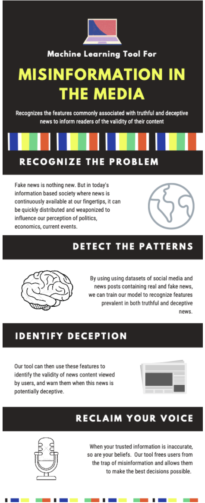

### Introduction

The aim of this project is to utilize different features of articles and social media posts regarding current events, politics, history, and economics to predict if these posts are instances of reliable or fake news. Fake news refers to the deliberate distribution of misinformation—news whose main purpose is to distort the truth for the intention of persuasion seeking to drive action. Coupled with the fact that misinformation has the tendency to spread faster online than real news by a substantial margin (*Vosoughi*), it is crucial that we provide readers with the tools to recognize the validity of their news so that we can collectively use accurate information to make the best decisions possible on policies that impact us all.
 
The spread of misinformation should be viewed as a threat to the digital landscape. We will build a tool that automatically scans through articles and posts, using feature patterns commonly associated with real and fake news to recognize these works as either truthful or deceptive. A tool like this would be of great use as it could warn the people viewing this content if it falls into a potentially deceptive category, signaling that they should not trust the source or at least be highly skeptical of its validity.

### Methods
Our method for this project relies on two major steps. Step one will be performing unsupervised learning on large datasets of articles. Our proposed process for this step will be to tokenize the articles and cluster them into groups using DBSCAN. We will do this process both with a dataset of generic articles and with a dataset that has also been labeled as fake news or not.
 
The second step will be to create a supervised classifier based on the label dataset. We will use this classifier to label the items in the clusters from step one. Our analysis for this project will revolve around whether certain groupings of articles (of which we will examine for similarities) have a higher rate of fake news.

### Results
Based on the clustering results given by the unsupervised clustering, we hope to be able to identify clusters and characteristics of those clusters that are highly associated with fake news. For example, if we discover that articles that have calls to action or are written with inflammatory words are typically fake news, while articles that describe multiple points of view or are written using academic language are typically legitimate, we could use these clusters as good indicators of fake news and accurate information. Later, when doing supervised learning, it will allow us to better choose the parameters we want to study.
 
For supervised learning, we want our model to be able to accurately predict which news articles are misinformation in the test data when using the training data as a guide.

### Discussion

The best outcome of this project would be a successful prediction of the accuracy of a news article. Misinformation could be unintentional, false stories, or news developed for the purpose of influencing the reader in a certain direction (_Thota_). The news article will then be flagged with its validity level and readers will be aware of the reputability of the article. This will, in turn, lead to a slowed spread of fake news. A better-informed reader will lead to them making decisions based on facts rather than misinformation that they might have been consuming otherwise. If mainstream media outlets and platforms were able to better screen for accurate information, the public discourse around controversial issues would be heavily improved.

### References

1. Vosoughi, Soroush. “The Spread of True and False News Online.” Science, vol. 359, no. 6380, 2018, pp. 1146-1151. Science, [science.sciencemag.org/content/359/6380/1146](http://science.sciencemag.org/content/359/6380/1146).

2. Thota, Aswini, et al. “Fake News Detection: A Deep Learning Approach.” SMU Data Science Review, vol. 1, no. 3, 2018. [https://scholar.smu.edu/datasciencereview/vol1/iss3/10/](https://scholar.smu.edu/datasciencereview/vol1/iss3/10/).

3. Mustakim et al 2019 J. Phys.: Conf. Ser. 1363 012001. "DBSCAN algorithm: twitter text clustering of trend topic pilkadapekanbaru." [https://iopscience.iop.org/article/10.1088/1742-6596/1363/1/012001](https://iopscience.iop.org/article/10.1088/1742-6596/1363/1/012001)

_This project proposal is produced for Georgia Tech CS 4641 - Fall 2020_
