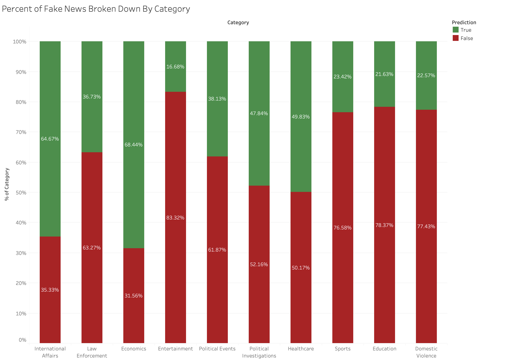

## Purpose & Goal
The purpose of our project is to identify whether certain categories of articles were more reliable or more fake through the analysis of different features of an article. Fake news refers to the deliberate distribution of misinformation—news whose main purpose is to distort the truth for the intention of persuasion seeking to drive action. When clustering the data using feature extraction and TF-IDF vectorization, we can separate out the different types of articles into topic models based on the dataset articles’ content. Our goal is to assign each article to one of these topics. We will then train a classifier using a different dataset of articles labeled “fake” or “not fake.” Finally, when we run the classifier on the original dataset of articles grouped by topic, it can help identify which topics have the highest tendencies to spread misinformation. This way online publishers can better partition resources to combat misinformation where it is most needed.

## Clustering by Content
For the unsupervised portion of this project, our group decided to employ a clustering algorithm in order to get an idea of what topics are present in our datasets. Our datasets are a collection of over 143,000 news articles from various publications with fields for information including the title, publication, author, year, and content. In order to begin creating clusters of the topics present in these articles, we had to first perform data cleaning to eliminate any “noise words”, which in this case were any words that were not informative to the topic of our articles (i.e. non-nouns, pronouns, adjectives, etc). We therefore ran a remove_nonnouns method which parsed through our dataset articles and removed any non noun words, because topics are almost always nouns and the inclusion of other words would convolute our clustering algorithm.

Next, we used pure feature extraction from the article text content in order to convert our text into numerical values and separate and cluster based on similarity. For this text clustering we used TF-IDF (Term Frequency-Inverse Document Frequency) vectorization, which is a method for comparing these numerical values to determine how important a word is to a collection of texts—in this case our news articles. In other words, this gave us a ratio of the number of current words to the total number of words in our dataset, and we used the highest ratios to form our topic word clusters. We performed this TF-IDF vectorization only on the article content so as to avoid unnecessary clustering based on irrelevant fields like publication name, author, and date. We chose to set the maximum number of features at 5,000 after taking into consideration the high volume of articles and content being parsed. We also chose to ignore terms that appear in greater than 95% of articles and terms that appear in less than 2 articles to ensure that our features are of relatively significant value.

After feature extraction it was time to use an NMF (non-negative matrix approximation) model for topic modeling. This works by decomposing our TF-IDF vectors in order to discover underlying relationships between texts. The result will be clusters of word features belonging to the same topic. We chose to fit our data into ten clusters after concluding that this was the optimal number to ensure proper uniqueness of our cluster topics. The result is ten clusters of 5,000 words separated into groups according to their topic.

### Understanding the Unsupervised Dataset
We separated our data into 10 separate clusters based on the distribution of words in each article. Afterwards, we looked at the most common words for each cluster, and saw that each cluster generally shared a common theme. For example, one cluster had “voter campaign candidate party election poll vote state nominee race” as its 10 most common words—clearly indicating that the articles in the clusters were highly related to political events. Another topic had “game team season player coach league year fan football ball” as its most frequent words, indicating that these articles were generally related to sports. This made sense for our classification, as we would expect articles to cluster around certain types of subjects, and for the words in articles of each subject to be generally more similar to each other than to articles of other subjects, resulting in this subject-based clustering.

### Cluster Distribution

The following image shows the sizes of each cluster of articles. We arbitrarily assigned the following names to the groups based on the general subject matter of the most common words in order to more easily distinguish the groups. Note that these names are in no way objective, and were assigned solely for ease in differentiating the groups.

| Number | Topic |
| --- | --- |
| 0 | International Affairs |
| 1 | Law Enforcement |
| 2 | Economics |
| 3 | Entertainment | 
| 4 | Political Events |
| 5 | Political Investigations |
| 6 | Healthcare |
| 7 | Sports |
| 8 | Education |
| 9 | Domestic Violence |

The distribution for our data was fairly similar between the different group labels. The smallest label had 5.74k data points, while the second largest had 16.99k. However, the largest group (with "people, film, life, time, thing" as its most frequent words) had 35.52k, which was quite a bit larger than any other group. This is largely dependent on what data set of articles was used, but it makes sense that the large number of articles with such broadly applicable words would form a single large cluster, while articles with words related to topics like sports or economics that share little overlap would instead form smaller individual clusters.

#### Label Weights of Example Article

One example of what happens after clustering is shown for the following article— _House Republicans Fret About Winning Their Health Care Suit_. The following chart shows the likelihoods that the article belongs to each label/category.

Based on the words used in this article, including “health”, “law”, “court”, and “insurance”, we would expect this to be under label 6 (Healthcare). However, it also shares some overlap with the words "president" and "report" commonly found in label 5 (Political Investigations), as well as the word "team" commonly found in label 7 (sports), adding to its likelihood of belonging to those groups. As such, our model gives it around an 76% likelihood of being under label 6, as well as a ~9% likelihood of being under label 5 and a ~6% likelihood for label 7.

It is worth noting that our distribution will have outlier articles. The outliers are either articles that don’t fit very well into any of the topics, or articles that are a combination of the topics. For example, a scientific article about space would be unlikely to fit strongly into any of the topics, or share a lot of words in common with them. On the other hand, an article about the presidential race and its impact on healthcare would likely share many words between labels 4 and 6.

### Visualizations for Each Label

Below, we have created word clouds showing the most frequent 15 words for each of the 10 groups. The words' sizes are directly proportional to their TF-IDF value used to cluster these articles. It is quite easy to see the general subject matter of each of the clusters based on these visualizations. This word cloud pictures were also how we decided on the category names.

**Group 0: "International Affairs"**  

**Group 1: "Law Enforcement"**  

**Group 2: "Economics"**  

**Group 3: "Entertainment"**  

**Group 4: "Political Events"**  

**Group 5: "Political Investigations"**  

**Group 6: "Healthcare"**  

**Group 7: "Sports"**  

**Group 8: "Education"**  

**Group 9: "Domestic Violence"**  

All in all, we are satisfied with the results of the unsupervised clustering, especially the way the articles formed groups with subjects relatively distinct from one another. This was useful as we moved forward into the supervised portion of the project. The end goal of the project is still to determine if certain categories from above are more or less prone to fake news.

## Creation of the Classifier
The next goal for the project was to build a classifier to help identify fake news in the unsupervised clusters. To accomplish this task we first needed to find a labeled dataset of online articles. This step proved to be a bit of a challenge because most labeled fake news dataset were based entirely on politics. Eventually, we were able to find a [dataset](https://www.kaggle.com/clmentbisaillon/fake-and-real-news-dataset) that contained several topics and was an appropriate size of ~39k labeled articles. It was not perfect, but definitely was workable for our project goal. It is important to keep in mind our project goal was not to create a perfect fake news classifier, but rather discover if there are certain categories that are more or less prone to fake news as a whole. Ultimately and ironically, when using a publicly available dataset you are still going by 3rd party's definition of fake news.

### Dataset Preprocessing
Even though we found a dataset that fit our requirement, it is worth noting we still had to perform the same preprocessing that we did on the article from the unsupervised learning section. This mainly includes putting it into a similar dataframe and removing all unnecessary non-nouns as they actually only distract and confuse the classification and clustering process.

### Selection of the Classifier
We tried training several models on the dataset, namely a Passive-Aggressive Classifier, a Decision Tree (with a max depth of 30), and Logistic Regression. The accuracy, precision, recall, and F1 scores of the three models were as follows:

**Passive-Aggressive**  

| Metric | Score |
| --- | --- |
| Accuracy | 0.9434 |
| Precision: | 0.9181 |
| Recall: | 0.9538 |
| F1 Score: | 0.9456 | 

**Decision Tree**  

| Metric | Score |
| --- | --- |
| Accuracy | 0.8654 |
| Precision: | 0.8210 |
| Recall: | 0.8947 |
| F1 Score: | 0.8748 | 

**Logistic Regression**  

| Metric | Score |
| --- | --- |
| Accuracy | 0.9361 |
| Precision: | 0.9115 |
| Recall: | 0.9453 |
| F1 Score: | 0.9396 | 

All 3 classifiers performed fairly well on the test data. In the end, we decided to go with the Passive-Aggressive classifier, because it had the best stats when compared with the other two models.  

Using the partitioned test data, it also had the following confusion matrix:
 

This classifier is named as such because it is “passive” for correct classifications, but is “aggressive” for miscalculations. It then adjusts and updates in order to correct the loss, with a goal of changing the norm of the weight vector as little as possible. Passive-Aggressive algorithms are specifically useful for large-scale learning on dynamic data, such as news that is released continuously. The Passive-Aggressive classifier always correctly classifies the last-seen data, whereas many other classifiers are not able to do this, as their update sizes are constant. The Passive-Aggressive classifier is also more efficient, which is important for our large dataset. We acknowledge the shortcomings of the Passive-Aggressive algorithm, however, as it is sensitive to noise in the dataset. This classifier is aggressive in the presence of noise, and updates accordingly. That said, due to the significantly successful statistical results of the Passive-Aggressive classifier, we decided to continue using the Passive-Aggressive classifier for our final step of the project.

## Classifying the Original Dataset
The next and final step of the project was to use the classifier we just created to classify the same articles used during the unsupervised learning. This was a fairly straight forward process that involved running the 143k articles through the model and saving what prediction label they received. The results we observed were truly fascinating, but we will dive more into examining the results later on. However, here you can see a chart broken down by category showing the rate of fake news in that category. Red represents the percent labeled fake news, while green represents the percent labeled true.

### Overall Classification Results
As you can see in the chart above, the results we observed were quite interesting. The first defining property of the results was the overall percent of the original 143k articles (61%) that were predicted to be fake news. At first glance, this value seems higher than expected. In fact one could point to the fact that the classifier used a 50/50 ratio of fake vs real news, which may point to an issue with the classifier. However, there are two important reasons why that is not the case. Firstly, the classifier’s confusion matrix (along with other statistics) clearly shows it is doing better than random guessing between fake and real news. Secondarily, fake news is simply far more present online than most people realize. While the exact figure is unknown it is estimated that over 50% of “articles” (using that term loosely) online are potentially fake news. This [article](https://www.digitalnewsreport.org/survey/2018/misinformation-and-disinformation-unpacked/) contains fascinating polls and surveys to show how widespread an issue this is.

### Category-by-Category Analysis
Looking deeper at each individual category, there are a few interesting things to point out. Starting with the categories with the least amount of misinformation, you have Economics and International Affairs. The goal of the project was to help content publishers know where best to focus their resources to monitor for fake news. Because these categories were significantly lower than the average, and are heavily related to topics that the supervised dataset contained, we believe we can say with high confidence that these topics are where content producers need to spend the least amount of resources.

Switching gears to focus on the categories of high rates of fake news, the worst predicted category is Entertainment. This result is not very surprising considering how many “click-bait” articles get written in this category plus the existence of tabloids. It is obvious that when discussing anything in the entertainment category content producers need to spend more time vetting articles and sources. 

However, things become a bit less clear when one notices that the next three highest categories are Education, Domestic Violence, and Sports. At first glance this may appear odd, and it may be partially due to the lack of generalizability of our training dataset (more on this in the following section). That said, we believe this project shines a light on just how widespread misinformation is. Currently, nearly all effort in this field is being spent on policing fake news related to Politics and related topics. Next to no effort is being spent analyzing fake news about Education or Domestic Violence. We are not claiming that our model proves that almost 80% of articles in these categories are fake news; Rather, we claim that fake news is prevalent in more areas than just politics, and clearly there is a lot to be gained by content procedures spending more time, energy, and resources on analyzing the validity of news in these categories.

## Project Limitations
Most of the limitations of our project were centered around the availability of datasets, mainly labeled fake news datasets. Since our project aims to identify the news article categories that are more likely to contain fake news, the diversity of our dataset, especially our classifier’s labeled dataset, is imperative to draw conclusions. In our touchpoints, we focused on the importance of having a more diverse dataset. Our model classified the “entertainment” and “sports” categories in this dataset as having the highest likelihood of being fake news. We concluded that this result may be a bit inaccurate due to the limited availability of articles in these categories within the classifier's labeled training and test datasets. Ultimately, a more diverse dataset of labeled articles would have likely led to our model being a bit more generalizable. Regardless, we hope that these results raise awareness of the importance of scrutinizing articles of all topics for misinformation. 

## Final Thoughts 
It is clear that higher scrutiny in Politics and related categories is helping to push those categories rates of misinformation lower and there is still a good bit to go to reducing the problem of misinformation. Additionally, our final analysis shows there is much work to be done in several unexpected categories like Entertainment, Education, and Domestic Violence. Our hope is that content producers and content hosting websites will see our work as reason to devote higher scrutiny to articles in these categories. It is not hard to imagine a system that could use simple keyword analysis to place the article into one of our 10 categories and then use a similar chart to what we produced to determine the appropriate level of scrutiny for the article.

_This project was created for Georgia Tech CS 4641 - Fall 2020_

